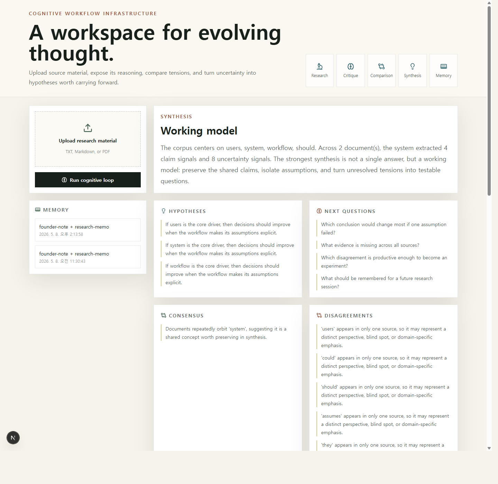

# Cognitive Workflow Infrastructure MVP

An AI-native research workflow for people who think for a living.



This MVP implements one loop:

Research -> Critique -> Comparison -> Synthesis -> Hypothesis

It is intentionally not a chatbot. The product surface is a calm workspace where uploaded documents become claims, assumptions, weak points, disagreements, syntheses, hypotheses, experiment ideas, product implications, next questions, and reusable memory.

## Stack

- `frontend/`: Next.js + Tailwind workspace UI
- `backend/`: FastAPI + lightweight JSON persistence
- Optional LLM adapters can be added behind the agent interfaces in `backend/app/agents`

## Run Locally

Backend:

```bash
cd backend
python -m venv .venv
.venv\Scripts\activate
pip install -r requirements.txt
uvicorn app.main:app --reload --port 8010
```

Frontend:

```bash
cd frontend
npm install
npm run dev -- -p 3001
```

Open `http://localhost:3001`.

## MVP Notes

- Upload `.txt`, `.md`, or `.pdf` documents.
- PDF extraction uses `pypdf` when available.
- Analysis has a local heuristic engine so the workflow runs without API keys.
- Memory is persisted to `backend/data/workspace_memory.json`.
- The architecture separates ingestion, critique, comparison, synthesis, and memory so richer agent orchestration can be added later without changing the UX contract.
